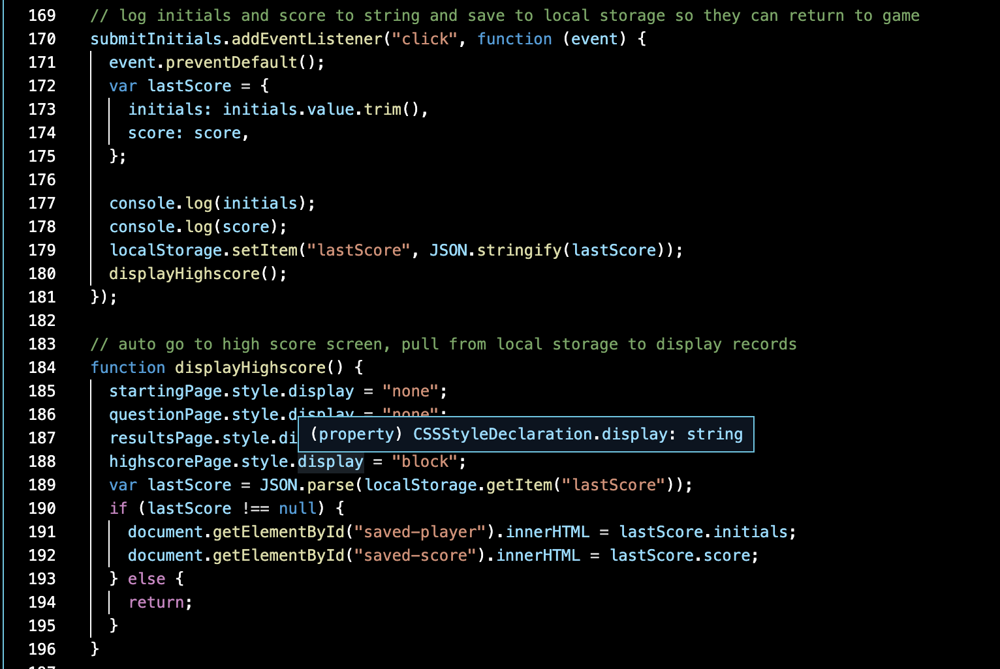

# Coding Quiz
​
Man did I learn a lot on this one. I started out by storing my questions and answers in data-attributes in the html file. As I got further and further into it realized how much of a mistake that was. I quickly noticed just how hard it would be to update this quiz at a later time and would be a headache for myself or anyone else that would need to work on this.  I had to scrap almost all my work and start from scratch.  It then became very apparent how powerful array can be.  I could later come in and add more questions with ease and the ability to only change a few parts of my code.  I also learned how much more I could go beyond that and start storying the information in objects.  This was a great challenge. 
​
## Screen Shot

In this section I was able to get a much better understanding of how to use an minipulate local strage.

## Built With
​
* [HTML](https://developer.mozilla.org/en-US/docs/Web/HTML)
* [CSS](https://developer.mozilla.org/en-US/docs/Web/CSS)
* [Javascript](https://developer.mozilla.org/en-US/docs/Web/javascript)
​
## Deployed Link
​
* [See Live Site](https://erikgustuson.github.io/coding-quiz/)
​
​
## Authors
​
* Erik Gustuson 
​
- [Link to Portfolio Site](https://erikgustuson.github.io/basic-portfolio/)
- [Link to Github](https://github.com/ErikGustuson)
- [Link to LinkedIn](https://www.linkedin.com/in/erik-gustuson/)
​
## License
​

MIT License

Copyright (c) [2021] [Erik Gustuson]

Permission is hereby granted, free of charge, to any person obtaining a copy of this software and associated documentation files (the "Software"), to deal in the Software without restriction, including without limitation the rights to use, copy, modify, merge, publish, distribute, sublicense, and/or sell copies of the Software, and to permit persons to whom the Software is furnished to do so, subject to the following conditions:

The above copyright notice and this permission notice shall be included in all copies or substantial portions of the Software.

THE SOFTWARE IS PROVIDED "AS IS", WITHOUT WARRANTY OF ANY KIND, EXPRESS OR IMPLIED, INCLUDING BUT NOT LIMITED TO THE WARRANTIES OF MERCHANTABILITY, FITNESS FOR A PARTICULAR PURPOSE AND NONINFRINGEMENT. IN NO EVENT SHALL THE AUTHORS OR COPYRIGHT HOLDERS BE LIABLE FOR ANY CLAIM, DAMAGES OR OTHER LIABILITY, WHETHER IN AN ACTION OF CONTRACT, TORT OR OTHERWISE, ARISING FROM, OUT OF OR IN CONNECTION WITH THE SOFTWARE OR THE USE OR OTHER DEALINGS IN THE SOFTWARE. 
​
## Acknowledgments
​